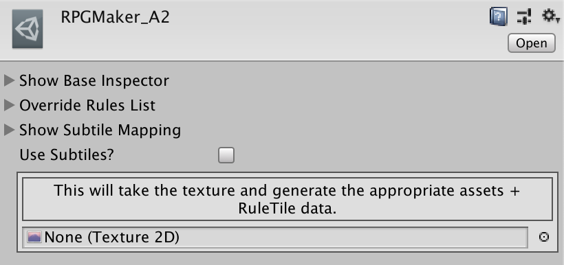

# FullsizedAutoTile

## Usage
Drag and drop an A2-formatted texture onto the Texture2D parameter on the RPGMaker_A2.  This will generate a series of sprites in `Autotiles/[texturename]/`, as well as a RuleTile in that same folder.  See the Examples folder for example usage & output.

## Notes
### Import Settings
This tool makes no assumptions about import settings for your tiles, so you may need to manually bulk edit the import settings for your tile's needs (or write an import preprocessor)

### ScriptableObject
I left the basic usage in the actual data ScriptableObject for my own reasons, but if you are feeling keen, its not a lot of work to adjust the functionality to a `right click` action.
